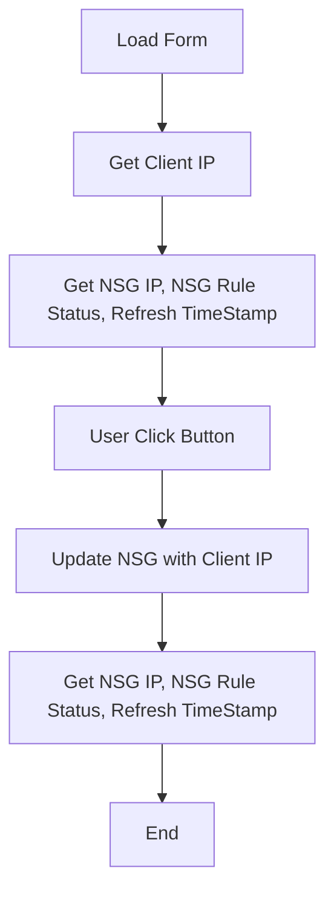

# Application Design notes

## Application Flow
Ref: https://mermaid.js.org/syntax/flowchart.html

## Application Components
### Power Forms
1. Application Form with function to retrieve & display Client IP - Based on https://github.com/yashag2255/WhiteList-IP-Address-in-Canvas-Apps/
### Serverless Functions
1. Get NSG IP, NSG Rule Status, Refresh TimeStamp
1. Update NSG with Client IP

