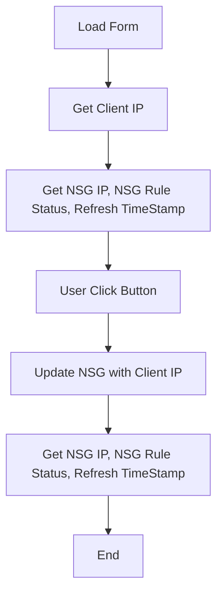

# Application Design notes

## Application Flow

## Application Components
### Power Forms
1. Application Form
1. Form function to retrieve & display Client IP
### Serverless Functions
1. Get NSG IP, NSG Rule Status, Refresh TimeStamp
1. Update NSG with Client IP

